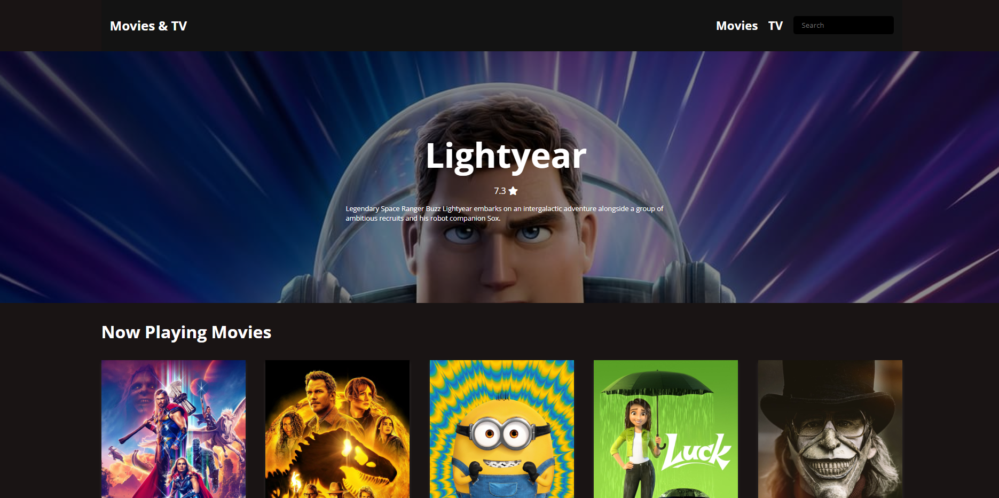
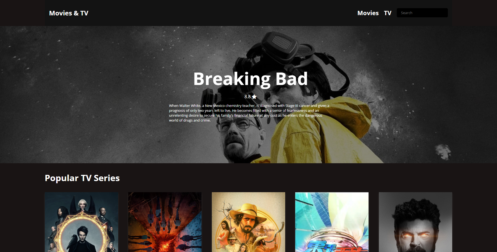

<!-- Readme doc -->

# Movies & TV Website with TMDB API

## Overview

This project is a website that lists down various movies and TV shows on the basis of certain categories.  

This website uses the concept of Fetch API in JavaScript to fetch the data from the TMDB API to showcase all the content.

**View the project [here](https://sumansourabh14.github.io/Movies-TV-Website/)** 

---

## Features

* Lists down all the movies and TV shows based on different categories
* Filter the movies and TV shows with the help of search functionality by using the Search API

---

## Technologies Used

* HTML
* CSS
* JavaScript

---

## Project Structure & Description

The file or the project structure is arranged as follows:

#### HTML
* index.html
  * The is the root file and the home page of the whole project.
  * Lists down all the movies.
* tv_series.html
  * This HTML file lists down all the TV series.

#### CSS
* CSS Folder
  * This folder contains the style.css file that is responsible for the styling of the website.

#### JavaScript
* JS Folder
  * This folder contains the JavaScript (.js) files featuring all the logic of the website by using the concepts of:
    * Fetch API
    * DOM (Document Object Model)

---

## Screenshots

1. Movies Webpage
    * Lists down the movies

2. TV Series Webpage
   * Lists down the TV series

---

## Helpful Links

* [TMDB Home Page](https://www.themoviedb.org/)
* [TMDB API Documentation](https://www.themoviedb.org/documentation/api)

---

Thank you for reading!

Made by Suman Sourabh | 2022